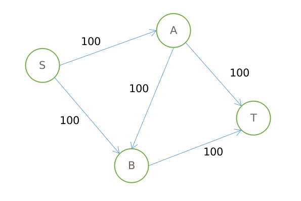
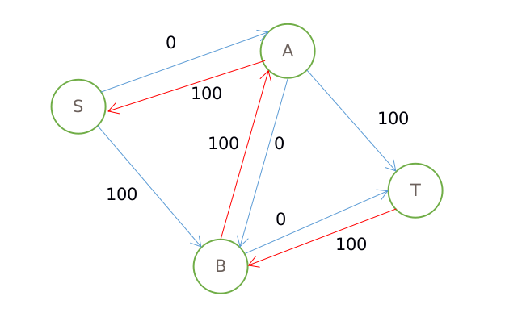
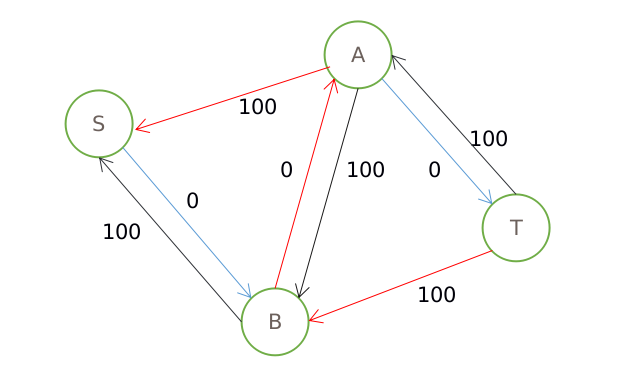

最大流算法
==========

首先来认识一下网络流中最大流的问题

给定一个有向图G＝(V，E)，把图中的边看做成管道，边权看做成每根管道能通过的最大流量（容量），给定源点s和汇点t，在源点有一个水源，在汇点有一个蓄水池，问s－t的最大水流量是多少。

网络流图里,源点流出的量等于汇点流入的量,除源汇外的任何点,其流入量之和等于流出量之和。

首先我们来看下面的图



s是源点，t是汇点。

先这么想，先用 dfs 找出一条从 s-t 的路线，把他塞满，然后流量就是路径中容量最小的那条路的容量，然后把路径上的容量都剪去这个流量，再重新从 s-t 找可行路径，直到找不到为止。

用这种思路看这个图

先走 S-A-B-T ，这样流量为100，并且没有可行路径了，即操作结束。

可是很明显,从S-A-T,S-B-T这两条路加起来的流量为200。所以这种思路是错的。

主要是过早的认为A-B的流量不为0

改进的思路：建立一个可以修改的网络，使得不合理的流可以被删掉

一种实现：对上次dfs时找到的流量路径上的边，添加一条“反向”边，反向边上的容量等于上次dfs时找到的该边上的流量，然后再利用“反向”的容量和其他边上剩余的容量寻找路径。

使用这种思路再求一次

第一次dfs后



第二次dfs（为了方便把容量为0的边删了）




这个时候已经没有可以走的边了，流量为200，dfs结束。

为什么这种思路是正确的呢，网上有不少详细的证明。Ford-Fulkerson算法，就是用这种思路做的。

用dfs求增广路径，每次找到之后处理，直到找不到为止。

假设有n个定点，m条边，那么dfs的复杂度为n+m；

dfs运行c次

所以复杂度为c*(n+m);

但是dfs可能会运行很多次。

比如上面的图如果A-B中有条容量为1的边，那么运气不好的话，能执行200次dfs；

但实际上只要用2次就能找到

在每次增广的时候，选择从源到汇的具有最少边数的增广路径,即不是通过dfs寻找增广路径，而是通过bfs寻找增广路径。
这就是Edmonds-Karp 最短增广路算法
已经证明这种算法的复杂度上限为nm2 (n是点数， m是边数）

Edmonds-Karp　算法实现的思路：

1. 用 bfs 寻找从 s 到 t 的路，可将这条路径保存到一个数组。

2. 沿着这条路，找出这条路上流量的最小值 d.

3. 将这条路径，从 s-t 的流量减去 d ,从　t - s 的流量增加 d.

4. 回到第一点，直到找不到从 s 到 t 的路为止。

看例题（POJ-1273）：

```c++
#include <iostream>
#include <queue>
#include <cstring>
using namespace std;
const int maxn = 205;
const int inf = 1e9;
int mp[maxn][maxn];
int path[maxn];
int n, m;
bool bfs(int s, int t)
{
  queue<int> que;
  que.push(s);
  memset(path, -1, sizeof(path));
  path[s] = s;
  while (!que.empty()) {
    int q = que.front();
    que.pop();
    for (int i = 1; i <= m; i++) {
      if (mp[q][i] > 0 && path[i] == -1) {
        path[i] = q; // 记录路径
        if (i == t) {
          return true;
        }
        que.push(i);
      }
    }
  }
  return false;
}
int ek(int s, int t)
{
  int flow = 0;
  while (bfs(s, t)) {
    int d = inf;
    //寻找 s - t 路径上流量的最小值
    for (int i = t; i != s; i = path[i]) {
      d = min(d, mp[path[i]][i]);
    }

    for (int i = t; i != s; i = path[i]) {
      mp[path[i]][i] -= d;  //将 s - t 路径流量减去　d
      mp[i][path[i]] += d; // 添加反向边，t - s 路径流量增加　d
    }
    flow += d;
  }
  return flow;
}
int main()
{
  while (cin >> n >> m) {
    memset(mp, 0, sizeof(mp));
    for (int i = 0; i < n; i++) {
      int a, b, c;
      cin >> a >> b >> c;
      mp[a][b] += c;
    }
    int ans = ek(1, m);
    cout << ans << endl;
  }
  return 0;
}

```
